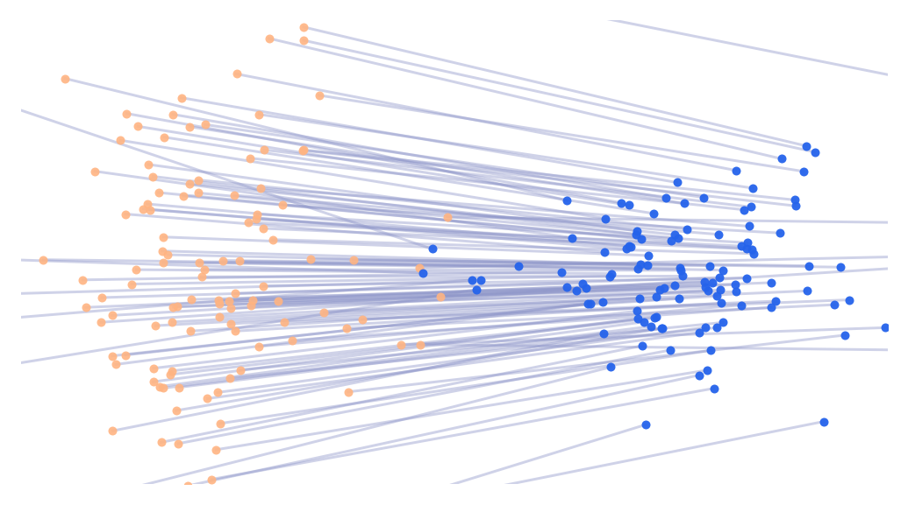
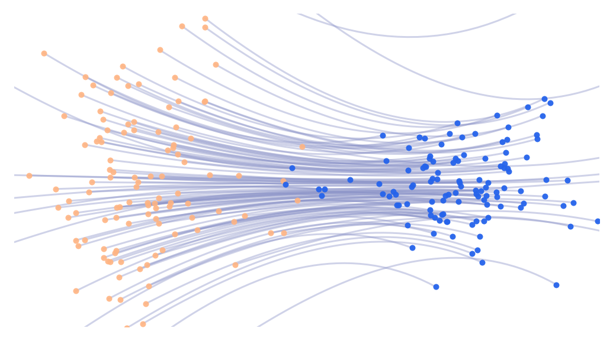
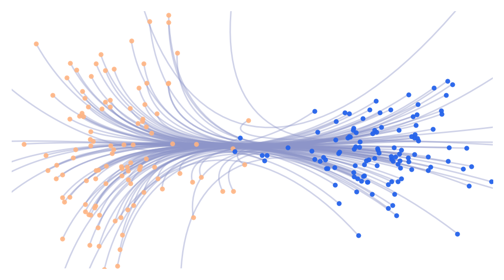
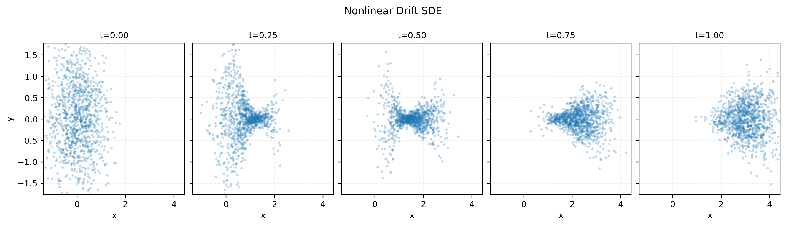

# Moment-Constrained Flow Matching for Trajectory Inference

## Description

This repository contains a CPU-first, simulation-free implementation of **moment-constrained flow matching** for trajectory inference from unpaired population snapshots.
We learn endpoint-preserving conditional paths, enforce intermediate aggregate constraints (moments and optional soft composition constraints), and then train a global velocity field with flow matching.
The codebase is designed for reproducible research runs on synthetic bridge dynamics and single-cell benchmarks (EB and Schiebinger), with benchmark runners and paper-linked artifacts.
The learned conditional paths below provide a direct visual summary of the method behavior versus CFM and MFM baselines.

| Flow Matching | Moment-constrained FM | Metric FM |
|---|---|---|
|  |  |  |

Nonlinear Drift SDE (synthetic bridge anatomy):



## Project Structure

```text
.
|--- src/
|    |--- cfm_project/                    # Core first-party implementation (data, constraints, training, metrics, pipeline)
|--- configs/                             # Hydra presets: experiment/train/data/model/mfm
|--- scripts/                             # Benchmark runners, sweeps, and paper-figure export scripts
|--- tests/                               # Unit/integration tests for core modules and script contracts
|--- datasets/                            # Local single-cell .h5ad datasets used by empirical runs
|--- outputs/                             # Run artifacts: comparison_mfm.json, summaries, tables, plots
|--- Overleaf_paper/
|    |--- neurips_2026.tex                # Main paper source
|    `--- Images/                         # Paper figures reused in this README
|--- ARCHITECTURE.md                      # System map and module interaction flow
|--- PROJECT_STATE.md                     # Append-only chronological change/decision log
|--- DISCUSSION.md                        # Method alternatives, tradeoffs, and rationale notes
|--- EXPERIMENTS.md                       # Experiment index with output-folder traceability
|--- TrajectoryNet/                       # External baseline repository (reference, not first-party architecture)
|--- metric-flow-matching/                # External MFM baseline repository
`--- conditional-flow-matching/           # External CFM baseline repository
```

## Environment Setup

```bash
python3 -m pip install -e '.[dev]'
pytest -q
```

Lightweight pipeline sanity run:

```bash
python3 scripts/run_experiment.py experiment=comparison train=smoke output.save_plots=false
```

## Data

### EB benchmark input
Expected path for EB dual-track benchmark:

- `TrajectoryNet/data/eb_velocity_v5.npz`

### Schiebinger pilot preparation
Prepare the Schiebinger pilot dataset (`.h5ad`) with selected days and PCA:

```bash
python3 scripts/prepare_schiebinger_pilot_h5ad.py \
  --days 10.0 10.5 11.0 \
  --n-pcs 50 \
  --output datasets/schiebinger_serum_d10_d10p5_d11_hvg_pca50.h5ad
```

## Canonical Experiment Commands

### 1) Synthetic bridge dual-track benchmark (5 seeds)

```bash
python3 scripts/run_bridge_global_ot_3k_dual_benchmark.py
```

### 2) EB `p=0.5` dual-track benchmark (5 seeds)

```bash
python3 scripts/run_single_cell_eb_t05_constraint_family_dual_benchmark.py \
  --data-path TrajectoryNet/data/eb_velocity_v5.npz
```

### 3) Schiebinger pilot + step-sufficiency quick-check

```bash
python3 scripts/run_single_cell_schiebinger_pilot.py \
  --data-path datasets/schiebinger_serum_d10_d10p5_d11_hvg_pca50.h5ad

python3 scripts/run_single_cell_schiebinger_step_sufficiency_quickcheck.py \
  --data-path datasets/schiebinger_serum_d10_d10p5_d11_hvg_pca50.h5ad \
  --seed 3
```

## Highlighted Results (Single Table)

Synthetic nonlinear-drift SDE, **velocity-field pushforward** (`W2`, lower is better), copied from `Overleaf_paper/neurips_2026.tex` (`tab:bridge_ab`):

| Method | W2@0.25 | W2@0.50 | W2@0.75 |
|---|---:|---:|---:|
| CFM | 0.3102 ± 0.0063 | 0.3608 ± 0.0058 | 0.2301 ± 0.0055 |
| Constrained | **0.2572 ± 0.0052** | **0.2134 ± 0.0068** | **0.0927 ± 0.0055** |
| MFM | 0.3528 ± 0.0316 | 0.3665 ± 0.0457 | 0.2889 ± 0.0429 |
| MFM+Constrained (AL) | 0.2867 ± 0.0170 | 0.2176 ± 0.0381 | 0.1578 ± 0.0428 |
| MFM+Constrained (soft) | 0.3517 ± 0.0318 | 0.3645 ± 0.0460 | 0.2871 ± 0.0432 |

Additional benchmark takeaways and full artifacts:
- EB (`p=0.5`, 5 seeds): best average performance comes from combining metric geometry with composition + moments in the reported matrix. Full outputs and tables: `outputs/2026-05-07/single_cell_eb_t05_constraint_family_dual_5seed_final/`.
- Schiebinger (5 seeds): classifier-informed constrained variants outperform unconstrained baselines on midpoint transport metrics in the reported setup. Full matrix outputs: `outputs/2026-05-07/single_cell_schiebinger_classifier_dual/03-25-51/`.
- Complete run-by-run index and intent summaries are in `EXPERIMENTS.md`.

## Outputs and Reproducibility Artifacts

Default Hydra run layout:

```text
outputs/<YYYY-MM-DD>/<experiment_or_run_root>/<HH-MM-SS>/
```

Common artifacts to inspect:
- `comparison_mfm.json`: per-method metrics for a comparison run.
- `benchmark_summary_*.json`: aggregated benchmark metadata and metrics.
- `tables/*.csv`, `tables/*.md`, `tables/*.tex`: paper-ready summary tables.
- optional plots/exports from figure scripts under `outputs/paper_figures/...`.

## Documentation Index

- [ARCHITECTURE.md](ARCHITECTURE.md): system map, module roles, and flow.
- [PROJECT_STATE.md](PROJECT_STATE.md): append-only project chronology and decisions.
- [DISCUSSION.md](DISCUSSION.md): alternatives/tradeoffs and methodological notes.
- [EXPERIMENTS.md](EXPERIMENTS.md): experiment index with output folder traceability.

## Citation

If you use this repository in research:
- Cite the associated paper source in `Overleaf_paper/neurips_2026.tex`.
- Cite external baseline repositories when their methods/data pipelines are used:
  - `TrajectoryNet/README.rst`
  - `metric-flow-matching/README.md`
  - `conditional-flow-matching/README.md`
